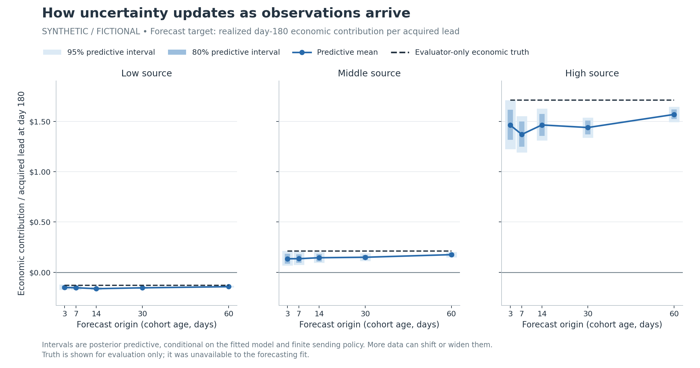

# Bayesian email cohort lab

**When will a paid email-acquisition cohort pay back, and how uncertain is that answer after 3, 7, 14, 30 or 60 days?**

A self-contained, synthetic-only research demonstration: simulate leads and delayed signed revenue, reconstruct exactly what was knowable at each cutoff, update a Bayesian model, and compare its forecasts with two inexpensive baselines. Everything runs locally with Python. No account, API key, paid model, database or hosted service is needed.

All source names, people/lead identifiers, costs, clicks, prices and results are fictional. This repository contains no production or historical company data. It is an educational model, not an investment recommendation or production-ready spending policy.



## The central finding

In a [well-specified controlled scenario](docs/CONTROLLED_SCENARIO.md), exact 95% predictive intervals cover about 94–96% across 2,000 independent worlds, and uncertainty falls as observations accumulate. That checks the conjugate response-rate component only.

Bayesian updating narrows uncertainty **within its assumptions**. In the richer stress worlds, the nominal 95% intervals cover only about 53–64% across forecast origins. Late reactivation is a particularly clear failure. The reports retain those misses and show why narrower intervals are not the same as validated confidence. The cold-start case also exposes heavy-tailed monetary-prior sensitivity.

## Start here

Read the draft article **[When does an email subscriber pay for itself?](article/article.md)**, or download this repository and open the [HTML preview](article/index.html). The [article folder](article/README.md) contains Markdown, MDX, responsive HTML, five main figures with mobile variants, source bindings and numeric tables. Desktop and phone browser layout review is still pending before publication to nickroth.com.

1. [Cold-start learning](artifacts/cold_start/RESULTS.md): follow the first cohort with no older history
2. [Reproduced demo results](artifacts/demo/RESULTS.md): what the chosen fictional cohorts did, with uncertainty and payback charts
3. [The implemented Bayesian mathematics](docs/MODEL_IMPLEMENTATION.md): priors, likelihood, finite-grid integration, predictive simulation and limitations
4. [How to read the charts](docs/READING_THE_CHARTS.md): parameter uncertainty, realized-outcome uncertainty, and why bands can move or widen
5. [Validation and calibration](docs/VALIDATION.md): what was checked, what was not, and how to reproduce it
6. [Causal A/B experiments](docs/CAUSAL_EXPERIMENTS.md): why a profitability forecast is not a treatment-effect estimate
7. [Tail-prior sensitivity](artifacts/sensitivity/RESULTS.md): compare tail supports and monetary-variance caps on the same data
8. [Controlled calibration](artifacts/controlled_scenario/RESULTS.md): when the Gamma–Poisson assumptions generate the data
9. [Research choices and extensions](docs/RESEARCH.md): primary references and a path to a richer model

## Reproduce

Tested with Python 3.12.14 on Linux. The source requires Python 3.11+; the exact dependency pins below target the tested environment. Commands below use a POSIX shell.

```sh
git clone https://github.com/rothnic/bayesian-email-cohort-lab.git
cd bayesian-email-cohort-lab
python -m venv .venv
. .venv/bin/activate
python -m pip install -r requirements.txt
python -m unittest discover -s tests -v
python run_bayesian_demo.py demo
python run_bayesian_demo.py cold-start
python run_bayesian_demo.py calibration
python run_sensitivity.py
python scripts/validate_conjugate_scenario.py
python scripts/validate_public_artifacts.py
```

Or run `make reproduce` after installing dependencies. A quick wiring test is `python run_bayesian_demo.py demo --quick --output artifacts/tmp-smoke`. Default commands regenerate the checked-in charts, CSVs and reports; runtime, versions, seeds and source hashes are recorded in each `run_metadata.json`. Included observations and draw-level forecasts are compressed CSVs and can be read with `pandas.read_csv` directly. Six row-level ledger/exposure exports are locally reproducible outputs excluded from the release bundle; see [data packaging](docs/DATA_PACKAGING.md) and [file manifest](PUBLIC_MANIFEST.json). No downloaded ledger or exposure file is required to reproduce the demo. There are no GitHub Actions workflows.

### What's being predicted?

- **Contribution** = attributed signed revenue − acquisition cost − attempted-email costs, in fictional USD; fixed overhead is excluded
- **Policy** = send daily at ages 0–365 while operationally contactable; allow bounded response and accounting lags through day 425
- **First payback** = the first economic age at which cumulative contribution is nonnegative; later costs or reversals can undo it
- **Never under this policy** = no crossing by day 425, not a claim about an unrestricted lifetime
- **Daily engagement** = qualified unique human clickers that day / original acquired leads; click-event intensity allows repeat clicks and is a different quantity
- **Contactability** = still eligible for sending; no click does not establish death or permanent inactivity

The unconditional payback distribution retains every nonpaying draw. A median payback date can be infinite. The model separately reports probability of positive contribution at a horizon and probability of staying nonnegative after the first crossing.

## What's implemented?

| Component | Implementation |
|---|---|
| Synthetic world | Heterogeneous sources, cohort and lead quality, rapid early response decay and long tail, operational exits, repeats, zero/positive variable revenue, calendar shocks, delayed reports, immutable signed revisions and missing telemetry |
| As-of reconstruction | Observed-time and economic-time filtering, latest available bot classification, explicit missing exposure cells |
| Baseline A | Pooled age-to-revenue curve, frozen exponential extrapolation |
| Baseline B | Observable operational survival, source response rate and mature signed revenue per click |
| Bayesian model | Finite-grid hierarchical Gamma–Poisson response model with uncertain age shape and cohort amplitudes, conjugate operational and revenue-mark uncertainty, future-outcome simulation |
| Replay | Same declared sending policy, actual calendar cutoffs at ages 3/7/14/30/60, complete economic truth isolated in evaluation |
| Validation | Unit/integration checks, margin error, CRPS, profitability and payback Brier scores, 80%/95% coverage and width, adverse scenarios |

This compact Bayesian implementation is deliberately smaller than a full hierarchical negative-binomial regression with learned shared calendar/content effects. It uses independent posterior draws from a finite mixture and conjugate distributions, not MCMC. The **two baselines remain deterministic point forecasts**, with no invented confidence intervals or profitability probabilities.

### Important limitations

The Bayesian distributions are conditional on their finite response-curve family, priors, operational assumptions and declared synthetic observation kernels. A known measurement kernel is a favorable assumption; it does not imply real-world delays are known. Calendar shocks, informative missingness and late reactivation can make the forecast confident and wrong. Grid-boundary mass and prior sensitivity should be inspected. Independent per-cohort predictions must not be summed as if they supplied a joint portfolio forecast.

The cold-start example also exposes a broad-prior failure: a few very large monetary draws can dominate a 500-draw mean even though moments are finite. Inspect medians, quantiles, monetary-prior sensitivity and mean Monte Carlo error before using expected-value decisions.

The 12-world stress suite has only three seeds per scenario. Repeated sources, origins and horizons in one world are correlated. It provides descriptive checks and whole-world bootstrap intervals, not a claim of calibrated production probabilities, a formal simulation-based calibration study or universal superiority. No inconvenient seeds are removed.

## Repository map

```text
parameters.json                   Frozen fictional data-generating assumptions
demo_config.json                  Seeds, cohort sizes, origins and draw counts
cohort_lab/                       Generator, signed accounting and point baselines
bayes_cohort/                     Bayesian model and posterior predictive simulation
run_bayesian_demo.py               Reproducible demo and stress suite
scripts/plot_results.py            Charts and result reports generated from CSVs
tests/                            Accounting, no-leakage and statistical checks
docs/                             Mathematics, interpretation, caveats and research
artifacts/demo/                   Checked-in synthetic observations, draws and charts
artifacts/calibration/            Held-out stress results and coverage diagnostics
```

The original baseline replay remains available with `python run_pilot.py smoke`, `python run_pilot.py heldout`, then `python build_report.py`. Those commands evaluate the baseline layer only; Bayesian results live in the separate demo/calibration outputs.

MIT licensed. See [LICENSE](LICENSE).
