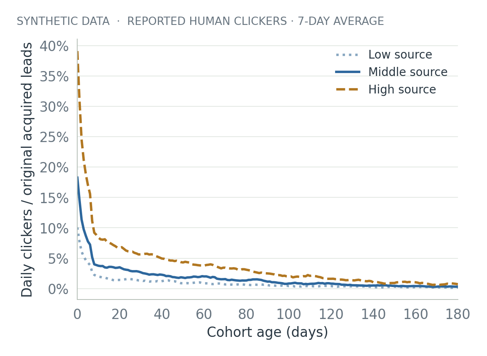
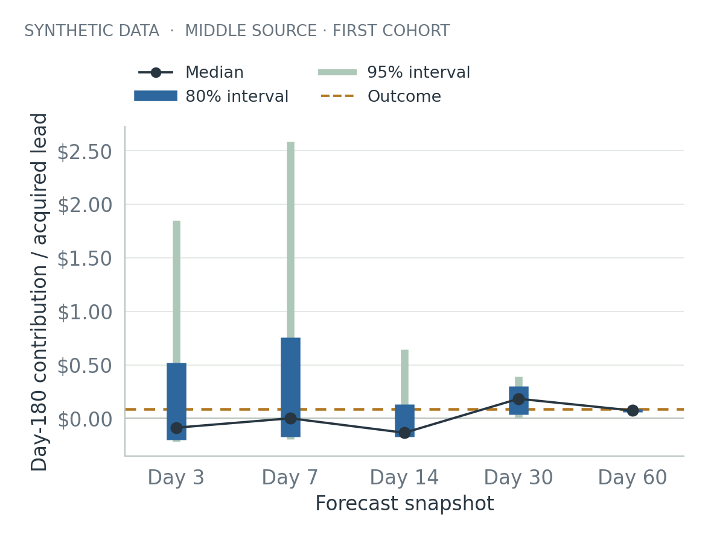
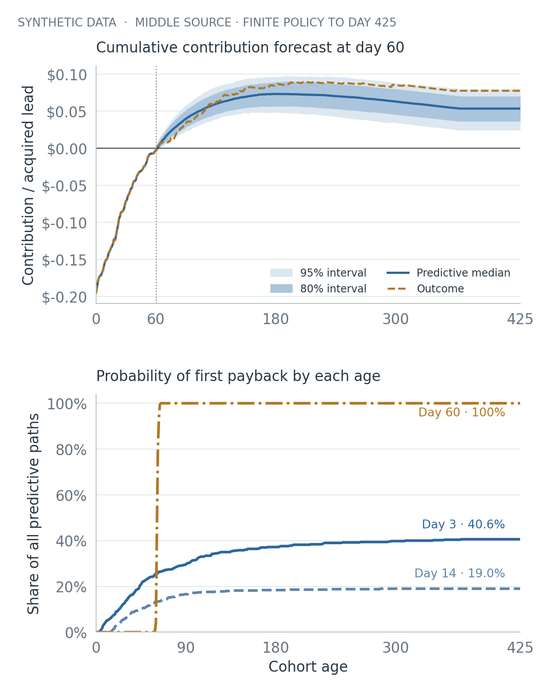
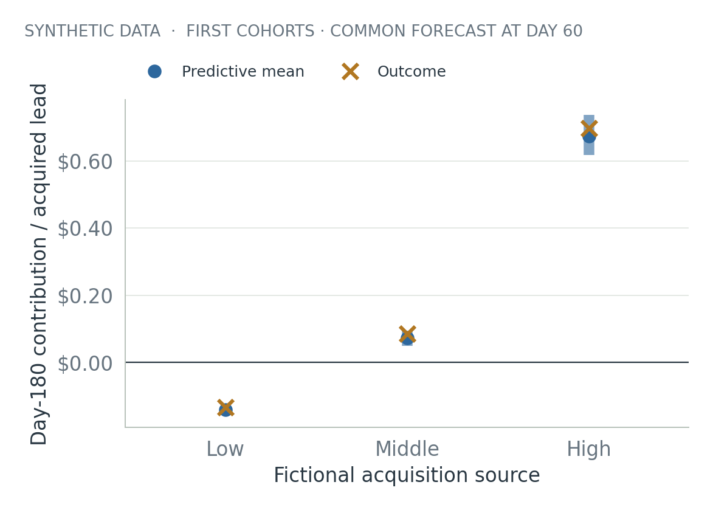
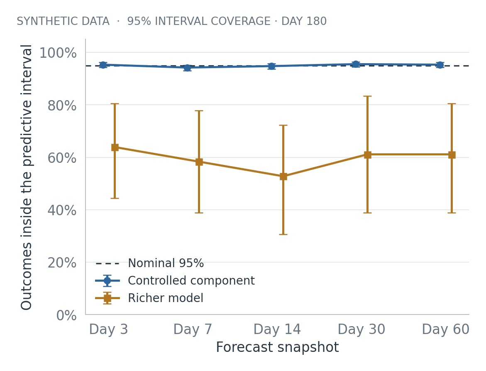

# When does an email subscriber pay for itself?

At DealNews, I started a project I didn't have time to finish. The question was how to use Bayesian statistics and decision theory to understand the economics of paid email leads. I remember an average acquisition cost of roughly twenty cents per lead. That's an unverified recollection motivating the question, not a historical number being validated here.

This article rebuilds the problem as a synthetic experiment, without company records.

Buying an email lead creates a cost today and a stream of uncertain outcomes later. A few days of clicks might look encouraging, but the decision depends on what those clicks are worth, how long responses continue, and what it costs to keep sending.

The useful question is whether a cohort will recover its acquisition and sending costs, and how much confidence to put in that forecast while most of its history is still ahead of it.

This project explores that question with a small Bayesian model and a reproducible simulation. The result is encouraging in one narrow setting and uncomfortable in a more realistic one. When the model's assumptions generate the data, its uncertainty behaves well. When the simulated world includes mechanisms the model misses, the intervals can narrow around the wrong answer.

**Every modeled lead, price, click and outcome below is fictional. These are simulation results, not historical results from DealNews or any other company or campaign.**

## Start with the economics

Consider a cohort of paid email leads. Acquisition happens once. Sending incurs a small variable cost. Some recipients click repeatedly, some never click, and some disappear for a while before returning. A click may earn nothing, a small amount, or an unusually large payment. Reports and later corrections can arrive on different days.

For this experiment, cumulative contribution at age h is:

```text
M(h) = signed attributed revenue through h
       − acquisition cost − sending cost through h
```

Contribution excludes fixed overhead. A positive number means this modeled acquisition-and-sending policy has covered its included costs; it doesn't establish company-wide profit.

Payback is the first age when that cumulative contribution becomes nonnegative. A later correction or more sending costs can push it below zero again, so first payback and being positive at day 180 answer different questions.

The policy is finite: send daily while eligible through day 365, then allow the declared response and accounting windows to finish by day 425. A simulated path that never crosses zero has **no payback under that policy**. It isn't silently dropped from the average payback date, and it isn't labeled a permanent lifetime failure.

## Keep the clocks separate

At each forecast, the model gets only the records that would have been available then. A response can occur today and be reported tomorrow. A revenue correction can change the economic picture weeks later. Treating an unreported outcome as zero would turn a reporting delay into apparent poor performance. Pending reports and revisions can also change estimates of past economic dates, so predictive paths are not forced through the currently visible ledger balance.

The lab keeps immutable signed ledger entries, event times and observation times separate. It also separates contactability from engagement. A recipient who hasn't clicked can still be eligible to receive mail. Unsubscribing is an observable operational exit; silence alone doesn't prove permanent loss of interest.

The simulated world includes three sources, variation between cohorts and leads, an early response drop, a long tail, delayed reports, variable click values and negative revisions. The forecasting model is intentionally smaller. Its reporting and settlement delay distributions are known synthetic instrument assumptions, rather than delays learned from production data. That makes this part of the problem easier than a real deployment. The remaining gap lets the experiment test how a reasonable-looking forecast can fail.



*Figure 1. Retrospective descriptive data from the fixed seed-211 world. Each source pools eight cohorts of 180 leads. Missing reports are excluded, and the latest reported human qualification is used. A daily clicker is counted once even if they click repeatedly; the denominator stays at the 1,440 originally acquired leads per source. Lines show seven-day trailing averages, using the available shorter window for the first six points. This describes reported engagement, not survival or a permanent exit.*

## Let the forecast change with the evidence

The model represents response rates with an early-decay component and a slower tail. Cohorts can differ while sharing information within a source. It also learns about operational exits, accepted sends, positive click values and ordinary revisions. The response curve uses a fixed candidate grid. The complete economic path combines several modules and approximations, rather than claiming one exact joint posterior over every report.

At an observation cutoff, Bayes' rule reweights the candidate explanations:

```text
posterior ∝ likelihood × prior
```

A predictive simulation then draws model parameters and possible future outcomes. Each draw produces a complete economic path, including costs and pending revenue. The shaded intervals describe possible realized contribution under the model, rather than just uncertainty about an average response rate.

The cold-start example follows the first cohort, with no older cohorts to learn from. For the fictional middle source, the estimated probability of positive contribution at day 180 moves from 36.4% at age three to 17.6% at age fourteen, then to 99.4% at age thirty. Later evidence changes the story; there is no rule that confidence must increase smoothly.



*Figure 2. One fictional middle-source cohort, seed 211, with 180 leads and 500 predictive draws per forecast. The line is the predictive median. The dashed outcome is shown only for evaluation; the model could not see it. Intervals are conditional on the chosen model and priors.*

An estimated 100% means all 500 sampled outcomes were positive. It doesn't mean risk has disappeared. Even before model error, finite simulation adds numerical uncertainty to probabilities and quantiles.

## Preserve the possibility of no payback

A payback chart should show the fraction of all predictive paths that have crossed zero by each age. If only successful paths remain in the denominator, the chart makes a losing cohort look much safer than it is.

For the middle-source cold-start forecast made at age three, 40.6% of paths pay back by the policy endpoint. The other 59.4% never cross zero within that policy. The cumulative curve should stop at 40.6%.



*Figure 3. Top: median and 80%/95% predictive ranges for cumulative contribution, forecast at age sixty; the dashed curve is evaluator-only truth. Bottom: all 500 predictive paths stay in each payback denominator. “Never” means no crossing through day 425 under the declared sending policy. Different lines are updated forecasts of the same fictional cohort. A finite-draw 0% or 100% is not certainty.*

This also clarifies two different business decisions. Stopping acquisition changes future purchases of leads. Stopping sends to an existing cohort changes future avoidable costs and revenue; its acquisition cost has already been incurred. Using the same profitability threshold for both can hide that difference.

## Compare cohorts on the same basis

Source differences matter, but the comparison needs a common age and horizon. These are the first cohorts from each fictional source, all observed for sixty days and all forecasting contribution at day 180. The modeled outcomes are substantially different even with those quantities held constant.



*Figure 4. The same seed-211 cold-start example, normalized per original acquired lead. Dots are predictive means and bars are 95% predictive intervals. Crosses are realized simulated outcomes. This is an illustrative source comparison, not a causal comparison or a validated recommendation for the next acquisition batch.*

The later-cohort version of the same seed is a useful counterexample. It can learn from older cohorts, yet at age sixty all three realized day-180 outcomes fall outside their nominal 95% intervals. Narrower can still be wrong. The supporting value tables keep that mature-history result separate from the cold-start illustration.

## Check a setting where the assumptions are right

Before interpreting a complicated forecast, it helps to check a simpler case whose answer can be calculated directly.

The controlled experiment uses a known response-age curve, fixed accepted exposure, a fixed value per response and known costs. Its fictional acquisition cost is fifteen cents per lead, separate from the rough twenty-cent recollection that motivated the question. There are no reporting delays, uncertain monetary marks or revisions. A cohort's response intensity θ starts with a Gamma prior. Observing N responses over weighted exposure L gives another Gamma distribution:

```text
θ ∼ Gamma(k, rate β)
θ | data ∼ Gamma(k + N, rate β + L)
```

Mixing future Poisson counts over that posterior gives a negative-binomial predictive distribution. Its quantiles can be calculated exactly, so the coverage check doesn't depend on drawing a small Monte Carlo sample of future counts. This is the same conditional rate update used by the main model, cross-checked against its implementation.

Across 2,000 independently generated worlds, the nominal 95% day-180 predictive intervals contain the realized outcome in 94.2% to 95.5% of worlds, depending on the forecast age. The mean interval width falls from $12.26 at age three to $3.83 at age sixty for these 100-lead cohorts. The profitability Brier score, which measures squared probability error, falls from 0.106 to 0.031. Lower is better.

That is useful evidence that the response-rate component updates correctly in this controlled setting. It leaves the harder observation, value and operational assumptions untested.

## Then check the world the model leaves out

The richer stress suite has twelve independently seeded worlds across four scenarios. Each forecast age contributes three source cohorts per world. The sources and repeated forecasts within a world are correlated, so the uncertainty calculations resample whole worlds instead of treating every row as independent evidence.

Here, the nominal 95% predictive intervals cover only 52.8% to 63.9% of the day-180 outcomes across forecast ages.



*Figure 5. The controlled check has 2,000 independent worlds at each origin. The richer check has twelve worlds and 36 source forecasts per origin; its whiskers are whole-world bootstrap intervals. The controlled whiskers are pointwise Wilson intervals across independent worlds. These are different data-generating settings, not a head-to-head claim that one production model is better.*

Late reactivation is especially revealing. The fitted age curves can decay, but they can't learn an unanticipated later return of engagement. At age sixty, eight of the nine source-cohort outcomes in the three reactivation worlds fall outside their nominal 95% day-180 intervals.

Those nine forecasts come from three independent worlds. This small set exposes a failure mechanism; it doesn't establish a production failure rate. All nine cases are retained in the supporting results.

A better point estimate doesn't settle the uncertainty question either. The source-aware survival-and-revenue baseline has lower average day-180 point error than the Bayesian predictive mean at ages three, seven, fourteen and sixty in this small suite. The Bayesian mean is better at age thirty. Neither result supports a general winner.

The two baselines currently produce point forecasts only. They aren't assigned made-up probability scores or interval coverage.

## Inspect what the prior allows

The cold-start example contains another warning. At age three, the high-source forecast has a day-180 median of about $0.08 per lead but a Monte Carlo mean of $9.84. Its central 95% interval runs from about −$0.17 to $4.50.

That mean sitting above the 95% interval is possible for a strongly skewed distribution. In this run, a few very large simulated monetary outcomes dominate the average.

The implementation puts an explicit upper bound on the variance of log click values. Without that bound, this particular Normal–inverse-Gamma mixture has an infinite expected positive payment after exponentiation. With the bound, its moments exist, but a 500-draw average can still be unstable.

The prior sensitivity check makes the issue concrete. Moving the log-variance cap from one to four changes the analytic prior mean of a positive payment from about $0.19 to $0.31, while its standard deviation grows from about $0.49 to $284. Those are properties of a deliberately broad fictional prior, not plausible estimates of an actual commercial payment distribution.

A finite expectation is a low bar. A useful monetary prior also needs to put sensible weight on outcomes before it is trusted with a budget decision. The lab keeps the awkward result visible instead of trimming the extreme draws until the picture looks better.

## What would make this useful in practice

The next work should focus on the mechanisms that change decisions:

- Validate event qualification, reporting delays, signed corrections and cost definitions against mature records
- Check tail assumptions and monetary priors before using early expected-value forecasts
- Test shared calendar changes and reactivation, and predict cohorts jointly when estimating portfolio risk
- Give the inexpensive baselines predictive uncertainty before making uncertainty-quality comparisons
- Evaluate acquisition and sending policies with explicit losses for false stops, missed opportunities and unnecessary spending

A layout experiment would need a separate causal design. This simulator retains randomized arm labels, but it does not estimate a treatment effect or demonstrate an A/B winner. A better source forecast isn't evidence that a new layout caused an improvement.

Bayesian updating gives a practical way to carry uncertainty through a decision. Its value depends on the questions attached to it: what could happen, what evidence has arrived, what the model assumes, and what failures would change the decision. The narrow intervals in this experiment become useful when their limits are visible.

## Reproduce the experiment

The [Bayesian email cohort lab](https://github.com/rothnic/bayesian-email-cohort-lab/tree/8e3443fe287d8e3ee29156d628df931b35fad9d5) contains the simulation, mathematical specification, tests, charts and reproducible artifacts. The scripts run locally with NumPy, pandas, SciPy and Matplotlib. No model API, hosted database or paid infrastructure is required.

The full replay and the controlled component check are separate commands. Six row-level ledger and exposure exports are generated locally rather than included in the release bundle; the declared seeds and configuration recreate them without an external data source.

The implementation passes 60 checks covering accounting, observation-time isolation, conjugate calculations, payback semantics and reproducibility. Those checks establish properties of this implementation. They don't turn the richer model's failed coverage check into a passing one.

### Further reading

- [Stan User's Guide: posterior predictive checks](https://mc-stan.org/docs/stan-users-guide/posterior-predictive-checks.html), including why checking the mean alone can miss model problems
- [Talts and colleagues: simulation-based calibration](https://arxiv.org/abs/1804.06788), for checking Bayesian computation under a model's own generative assumptions
- [McGough and colleagues: Bayesian nowcasting](https://journals.plos.org/ploscompbiol/article?id=10.1371/journal.pcbi.1007735), a useful example of separating event times from reporting times
