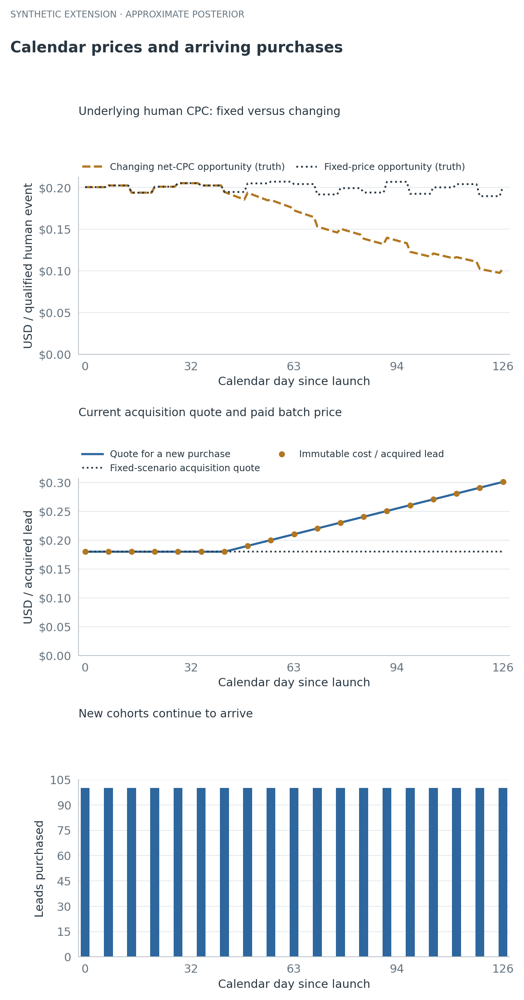
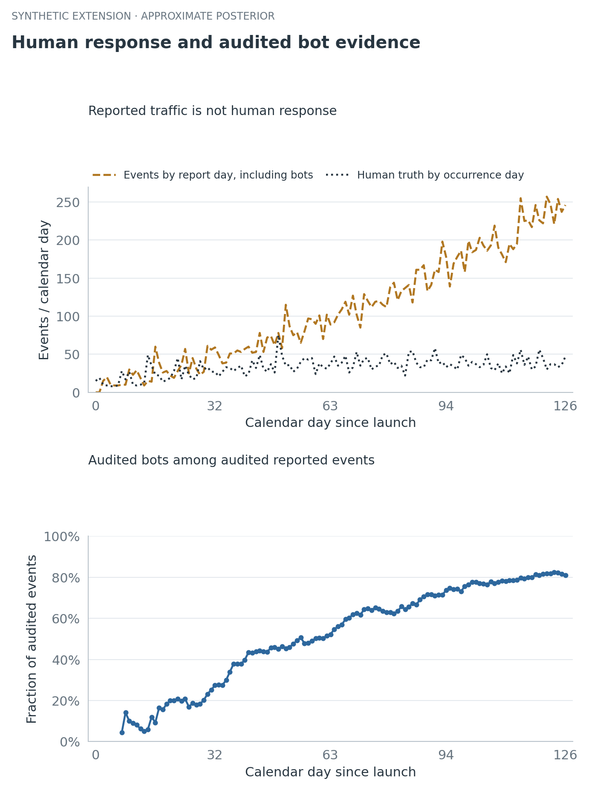
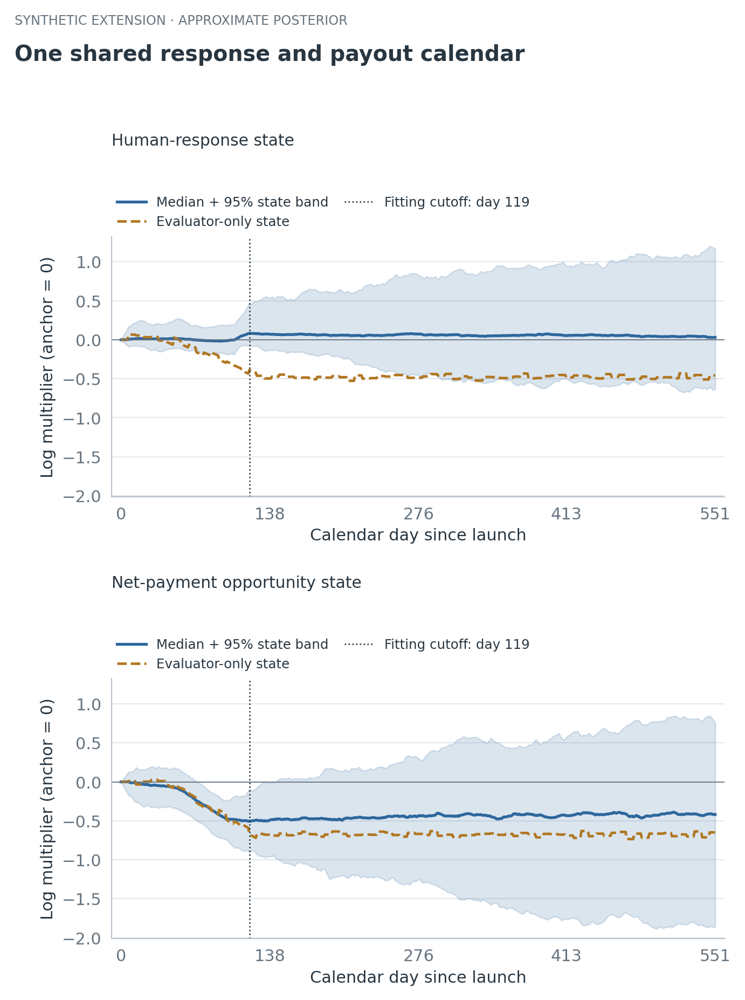
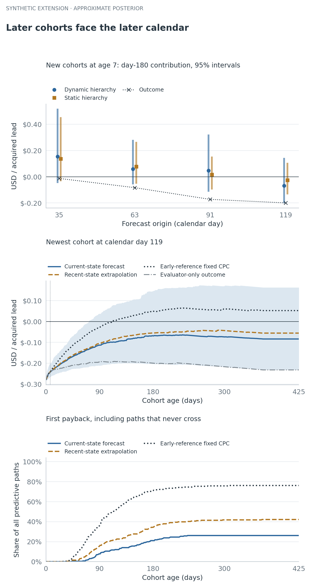
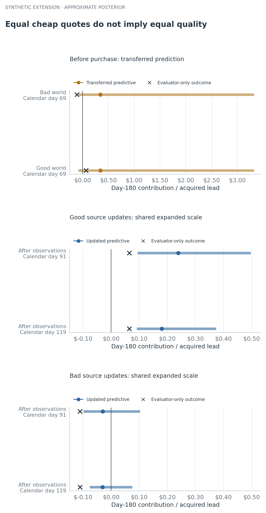
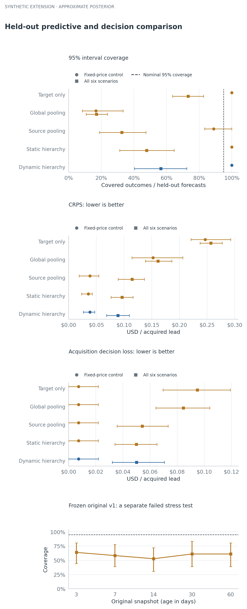

# When does an email subscriber pay for itself?

At DealNews, I started a project I didn't have time to finish. I wanted to use Bayesian statistics and decision theory to understand the economics of paid email leads. I remember an average acquisition cost of roughly twenty cents per lead. That's an unverified recollection motivating the question, not a historical number being validated here.

Buying a lead creates a cost today and uncertain revenue later. Some people respond quickly, some keep responding for months, and some never respond. Early clicks offer evidence, but they don't tell you what those clicks will be worth next quarter.

The question gets harder when the business changes while the cohort matures. Revenue per human response can fall. The next batch of leads can cost more. Automated clicks can rise while human response weakens. A new source might look attractive because it's cheap, even though nobody has seen its long-term behavior.

I rebuilt the problem as a reproducible simulation and fitted a Bayesian approximation to it. The point is to follow the uncertainty as evidence arrives, then check whether that uncertainty deserves our trust.

**Every modeled lead, price, event and outcome below is fictional. There are no DealNews records or historical campaign results in this experiment.**

## Start with a fixed-price cohort

For a cohort observed through age h, contribution is:

```math
M(h) = attributed net revenue through h
       − acquisition cost − sending cost through h
```

This excludes fixed overhead. Payback is the first age when contribution becomes nonnegative. First payback, positive contribution at day180, and staying positive afterward are different quantities.

The sending policy runs daily through age365, with a finite accounting endpoint at425. Every predictive path remains in the payback denominator, including paths that never recover their cost under that policy. “No payback by425” says nothing about an infinite lifetime beyond the modeled policy.

The [first version of the lab](https://github.com/rothnic/bayesian-email-cohort-lab/tree/8e3443fe287d8e3ee29156d628df931b35fad9d5) has a deliberately simple component check. With a known response-age curve, fixed prices and a Gamma–Poisson response model, its nominal95% intervals cover94.2%–95.5% of outcomes across2,000 independent simulated worlds. The richer original simulation covers only52.8%–63.9%. A working update formula doesn't validate every surrounding assumption.

The original first-cohort example also borrows information as acquisition continues. It has no older cohort history at launch. Later forecasts also use the observations available from younger cohorts in the same source. That version pools within a source, with independent copies of fixed priors across sources; it has no learned global prior.

The extension below actually adds global learning and calendar states. Its fixed-price comparison uses the new model's assumptions. It is not a renamed result from the original model.

## Let prices change while cohorts overlap

The new simulation starts with two established sources and a new100-lead cohort each week from each source. Each cohort follows the same declared early-drop and long-tail age shape. Then the scenarios add mechanisms one at a time: lower net revenue per valid human response, rising prices for new leads, declining human response with more bot events, and a late inexpensive source that can be either good or bad.

The distinction between old and new purchases matters. In the rich scenario, the established source's quote rises from$0.18 to$0.30096 per lead between calendar days0 and126. Its first100-lead batch still costs$18. A new quote never rewrites an old acquisition cost.



{{CAPTION_01}}

The hidden revenue opportunity in this figure is available to the evaluator. The fitted model sees mature settlement summaries at their report dates. It has to learn the price change from those observations.

## Treat bot activity as a measurement problem

Raw response events contain both human and bot activity. Repeated events are allowed; an event count isn't a count of distinct people. A random half of the events receives delayed human/bot labels from an imperfect audit instrument.

The instrument's sensitivity and specificity are known assumptions here: 95% and 98%. Raw events arrive after two days, audit labels after seven, and mature settlement summaries after fourteen. Before its arrival, a missing label or payment is unavailable information.



{{CAPTION_02}}

The estimated bot fraction is a fraction of **response events**, not a fraction of leads. Total human events can rise while per-exposure human response deteriorates because new cohorts keep arriving. The calendar-state comparison below asks about the underlying rate after accounting for the declared age shape.

This is a favorable measurement setting. A real audit's error rates may be unknown, change over time, or depend on what was selected for review. Without evidence about that process, a human/bot decomposition can remain unidentified.

## Share evidence at three levels

The response model has a global level, a source effect and a cohort effect. Net human revenue per response has a parallel hierarchy. Both also have a shared calendar state. In shorthand:

```math
log response rate = global + source feature + source effect
                    + cohort effect + age shape + calendar state
log net human CPC = global + source feature + source effect
                    + cohort effect + calendar state
```

A new cohort learns from its source while retaining its own variation. A source with no observations gets a predictive distribution from the learned population, including uncertainty in the global parameters, the new source and the new cohort. The code does not copy a successful source's posterior onto the newcomer.

At every cutoff, it refits all available observations from the same fixed hyperprior. Yesterday's posterior isn't reused as today's prior while yesterday's observations are counted again.

Age, calendar date and cohort birth date obey calendar=birth+age. Three unrestricted trends cannot be separated just because cohorts overlap. This experiment fixes the age curve, anchors calendar states at launch, and uses exchangeable cohort effects without a birth-date trend. The age curve matches the generator, making this another favorable assumption. Driver interpretations depend on these constraints.



{{CAPTION_03}}

In this illustration, the fitted value state follows the decline more clearly than the fitted human-response state. The response estimate stays closer to a flat calendar effect and misses much of the hidden deterioration. Separating the variables in a formula doesn't mean the observations identify them well.

The implementation uses Gaussian approximations to weekly log-rate and log-CPC measurements, then exact conditional Gaussian calculations and an integrated finite grid of scale priors. It isn't an exact latent-event, audit and payment posterior. Future event counts are drawn from a negative-binomial model, and net payment amounts use a Gamma approximation.

One boundary check caught a useful mistake: a zero-event bin initially received almost no log-rate uncertainty. The corrected half-count approximation gives it variance2 before the overdispersion term, rather than the0.02 numerical floor. The earlier result and correction are retained. A log transform at sparse counts still needs scrutiny; a repaired boundary case isn't proof of calibration.

The full [mathematical specification](../extensions/calendar/dynamic_lab/MODEL.md) states the priors, approximations and missing mechanisms. This extension fixes daily exposure and omits operational attrition, an unpaid-payment atom, future signed reversals and learned response/value correlation. The original version retains its separate accounting experiments. This extension is more detailed about calendar change, not more detailed about every part of the business.

## Separate a forecast from a future-price assumption

The model learns the calendar state available at a cutoff. That doesn't tell it which future policy will occur. I compare three conditional futures:

- Hold-current: no deterministic drift in the log states, with shared future innovations
- Continue recent trend: extend each sampled recent state slope, including uncertainty in that slope
- Fixed early price: freeze future payout at the learned early price reference, while retaining observed history

Hold-current isn't a learned prediction that prices will stabilize. A zero-drift log process also doesn't imply a constant arithmetic mean price. Extrapolating uncertain slopes can produce a strongly skewed monetary forecast, even when the median looks less optimistic.

Illustration probabilities use256 predictive draws. A reported0% or100% means none or all of those sampled paths met the condition; it does not establish certainty.

{{PRICE_COMPARISON}}



{{CAPTION_04}}

Each predictive draw uses one future response-calendar trajectory and one future price trajectory across all cohorts. Portfolio contribution is summed within the same draw. Drawing independent calendar shocks for every cohort would create diversification that the model doesn't justify. The two processes are independent of each other in this implementation; it does not learn their cross-process correlation.

{{PORTFOLIO_COMPARISON}}

## Let a cheap source prove itself

The late source arrives on day70 with a low quote and the same prespecified features in both the good and bad worlds. Cheapness changes the cost calculation. It does not reveal response quality.

{{TRANSFER_COMPARISON}}



{{CAPTION_05}}

Download the [offered-cost table](tables/offered-cost.csv).

The prior integrates the full new-source and new-cohort variation. Even so, there are only two established sources from which to learn the population in this example. Scale priors remain influential. If the model misses both realized outcomes with narrow intervals, that failure belongs next to the transfer plot.

## Check the uncertainty across held-out worlds

The final comparison keeps eighteen independently seeded worlds, three for each of six scenarios. It compares target-only learning, complete global pooling, complete within-source pooling, a static hierarchy and the dynamic hierarchy. Late-source evaluation includes the unseen launch and subsequent updates. Repeated cohorts and cutoffs within a world are correlated, so the intervals below resample whole worlds.

{{EVALUATION_COMPARISON}}



{{CAPTION_06}}

The acquisition-loss calculation is also conditional. It asks whether to commit to the next batch at the quote visible now, then measures realized loss against a hindsight-perfect buy-or-skip choice. It doesn't estimate a causal marketing effect or prove a production allocation policy. Continuing sends to an existing cohort is a different decision because its acquisition cost is already sunk.

{{PRIOR_CHECK}}

## What this changes about the decision

The useful output isn't one confident payback date. It's a distribution that changes as cohorts mature, current prices become visible, audit evidence arrives and a new source establishes its own history. Future-price assumptions should be explicit enough that someone can disagree with them and see the consequence.

The extended model can represent those questions now. Its held-out checks also show how much remains unresolved. Better average predictive error can coexist with intervals that are much too narrow. Added hierarchy and calendar states don't remove the need to check the evidence, the likelihood approximation and the decision loss.

A layout A/B test would still need randomized treatment and a separate causal analysis. A forecast that one source will earn more doesn't establish why it will earn more, or what would happen if the layout changed.

## Reproduce the experiment

The [public research repository](https://github.com/rothnic/bayesian-email-cohort-lab) contains both versions, their failures, the mathematical specifications, tests, saved summaries and figure code. The extension runs locally with NumPy, pandas, SciPy and Matplotlib. It uses no model API or paid infrastructure.

The article's values are bound to saved output rows and source hashes. Its figures include mobile variants, descriptive text and downloadable numerical tables. The original six row-level exports remain locally reproducible and excluded from the release. This is a draft for review, with no live website deployment.
